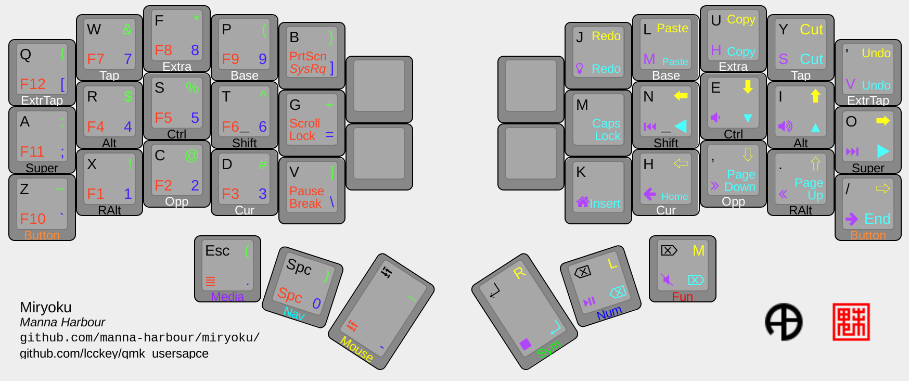

# lcckey's Keymaps

For instructions on how to setup see [main readme](https://github.com/qmk/qmk_userspace/blob/main/README.md).

For quick setup, mostly just run `qmk config user.overlay_dir="$(realpath .)"`

## Overview

This is my personal userspace file, based on [miryoku](https://github.com/drashna/qmk_userspace/tree/miryoku)

Changes:
- Added support for Vial
- Added RGB layout indicators
- Added ExtraTap layer
- On Tap and ExtraTap layers, I've left the bottom keys as normal to allow excaping the tap layers
- Added browser functions on media layer (Home, back, next tab, previous tab, forward) in place of unused bluetooth buttons

